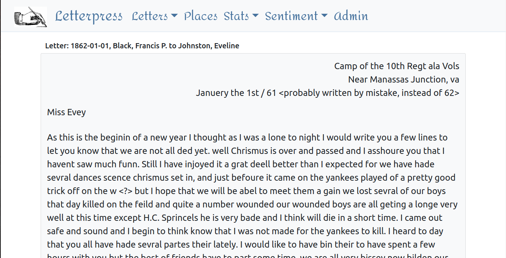
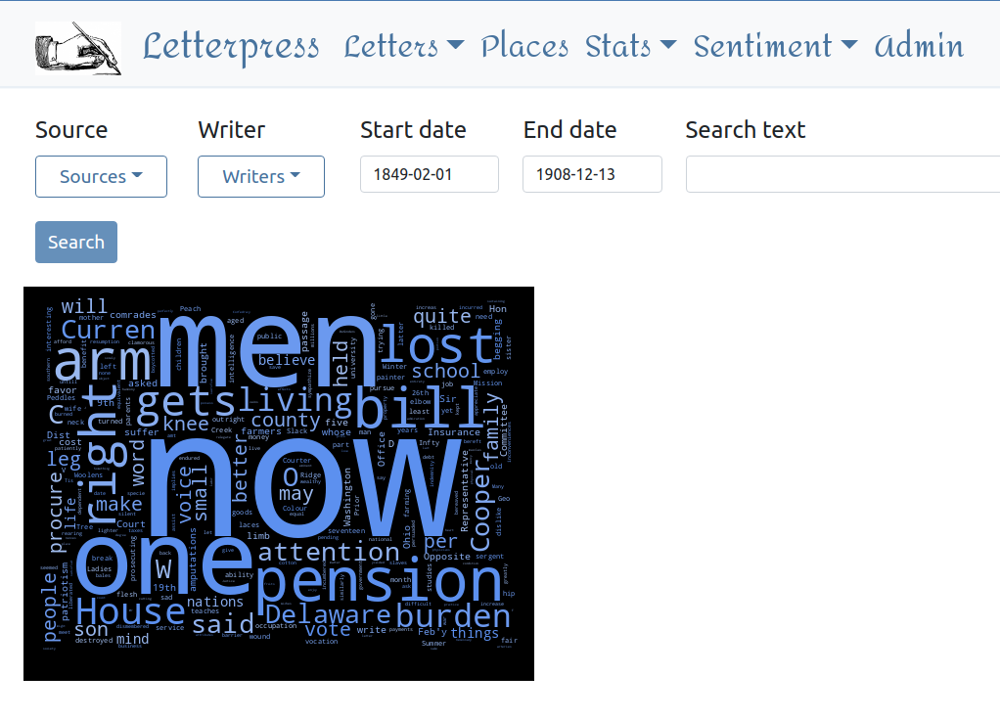

Letterpress
===========

[](https://circleci.com/gh/clairempr/letterpress/tree/unit-tests)
[](https://coveralls.io/github/clairempr/letterpress)
 
*Claire Pritchard*  
*April 2017 - Present*   

Letterpress is a [Django](https://www.djangoproject.com/) web application for the management of transcriptions and images of letters and related documents. 
I originally created it to help manage my transcriptions of 19th-century correspondence which I was using as input for 
natural language processing experiments. 

The name comes from an early office technology which people used to duplicate documents and store them in a 
[letterpress copybook](http://www2.archivists.org/glossary/terms/l/letterpress-copybook).

 

### Features ###

 - Highly customized Django Admin
 - Full-text searching with Elasticsearch
 
 - SQLite database
 - Place mapping with OpenStreetMap and OpenLayers 4
 
 - Export to text files
 - Word frequency statistics by month, with Bokeh charts
 
 - Word clouds for writers, date ranges, etc.
 
 
### Notes ###
 - Make sure you have write access to the SQLite database file `db.sqlite3`
 - Set up a Django Admin user with the command ```shell python manage.py createsuperuser ```.
 - Elasticsearch index can be created or updated manually with the Django management command push_to_index, otherwise updates are automatic when the model is saved.
 - Text searches are fuzzy by default. For exact match, enclose search terms in quotes.

### Setup with Docker ### 
 - Build the `django` and `elasticsearch` services:  
   ```docker-compose -f docker-compose.yml build```
 - Run the `django` and `elasticsearch` services:  
   ```docker-compose -f docker-compose.yml up```

### Setup without Docker ### 
 - [Elasticsearch](https://www.elastic.co/products/elasticsearch) must be installed and running.
 - See [GeoDjango](https://docs.djangoproject.com/en/1.10/ref/contrib/gis/) for information on using GIS features with Django.
 - [libspatialite](https://www.gaia-gis.it/fossil/libspatialite/index) must be installed and the location configured in Django settings.
 - [GDAL](http://www.gdal.org/index.html) must be installed. Windows binaries can be found here: http://www.gisinternals.com/release.php.
 - This application is much easier to run under Linux than under Windows. For Windows:
    - Install the GDAL core components for the appropriate version and set the GDAL_LIBRARY_PATH (path to GDAL dll) in Django settings.
    - Add the GDAL directory (containing GDAL dll) to your Windows PATH.
    - Add a System variable with name GDAL_DATA and value of the path to the gdal-data folder containing gcs.csv, etc.
    - If you get the error "no such module: rtree" or "Error transforming geometry...(OGR failure.)", try replacing sqlite3.dll in system python directory with another sqlite3.dll, like one from [OSGeo4W](https://trac.osgeo.org/osgeo4w/).
 - Download textblob corpora, for sentiment analysis: `python -m textblob.download_corpora`
    
### Credits ###
Photograph of copy press from [Letterpress Commons](https://letterpresscommons.com), 
map marker from [Maps Icons Collection](https://mapicons.mapsmarker.com), other images public domain.
Thanks to [Hipster Ipsum](https://hipsum.co/) and [Bacon Ipsum](https://baconipsum.com/) for some of the gibberish text in my unit tests.